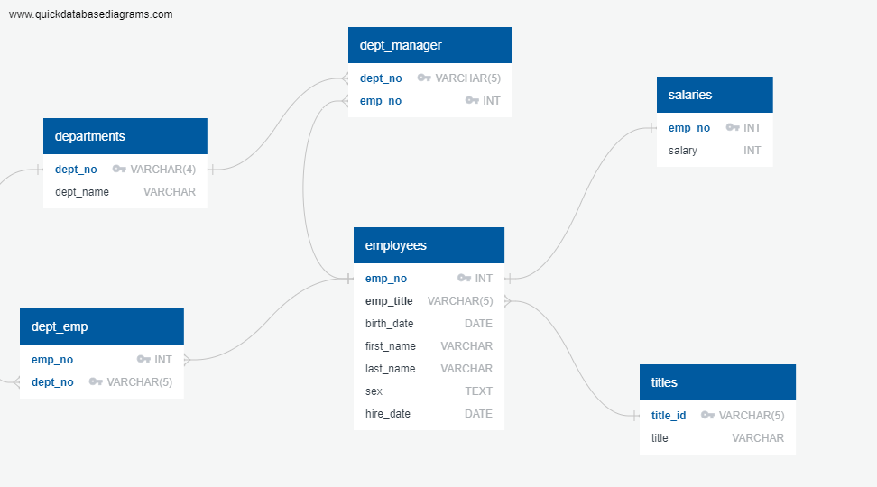

# sql-challenge
Using SQL to analyze employee data from the 1980s and 1990s for Pewlett Hackard. 

### *Data Engineering*
An ERD and table schemas were created for each of the CSV files and created in PostgreSQL and the data was imported. 

### *Data Analysis*
SQL queries were created to analyze the employee data - employee details, employees hired in 1986, manager details, employee departments, etc.

Bonus:
The database was also uploaded into Pandas and analyzed to graphically display the most common salary range for employees as well as the average salary by title. 

